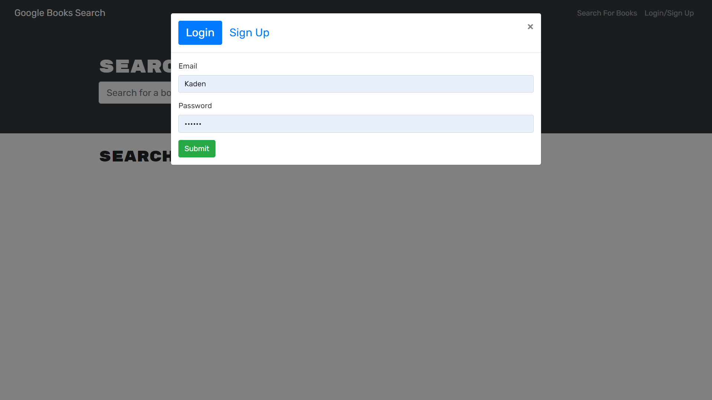
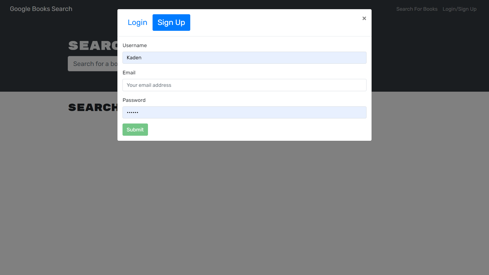
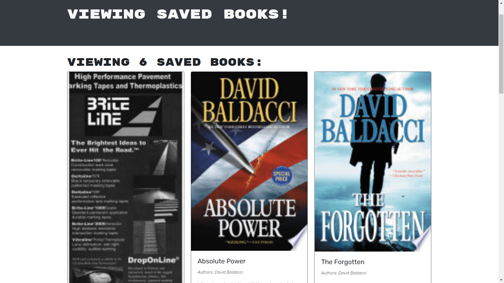

# HW21_MERNBookSearchEngine
---

## INSTRUCTIONS
This project is designed to allow the users to search for any book titles or authors and will be returned with a list of books via the GoogleBooks API.  Users are also allowed to create an account that will allow them the added feature of saving books to their account!
## Table of Contents
* [Installation:](#installation)
* [Usage:](#usage)
* [License:](#license)
* [Contribution:](#contributing)
* [Testing:](#tests)
* [Questions?](#questions)

## Installation
To install this app so that it functions properly, clone my github repository, open the integrated terminal tied to the current project folder, then run 'npm install' in your terminal. This should download all necessary packages.

## Usage
You can use this project to allow users to create an account that will allow them to save books they intend to read or look into.  You can also search books by author to find more books by your favorite author!

## Example
Here you can see some examples of the deployed website: (https://hw21booksearchengine.herokuapp.com/)

 # License
            This project is licensed under the MIT license (https://opensource.org/licenses/MIT)
            

## Contributing
Users can contribute to this project by examining the code to implement cool features such as a profile interface that allows you to pin your favorite books!  Contributers can also refactor the code into React.js syntax to polish up the UI and make the site smoother in transition.

## Tests
This project can be tested by installing the necessary packages then run the program on your local environment which can be done via your intergrated terminal or tools alike such as gitbash or windows powershell.

You can find find the deployed application via: (https://hw21booksearchengine.herokuapp.com/)

## Questions

    If you have any questions regarding the repository published, please feel free to reach out to me at kadenkelsey33@gmail.com,
    if you would like to look at the code that made this application, you can find this under my repos in GitHub. My GitHub
    username is K-Kelsey
    
